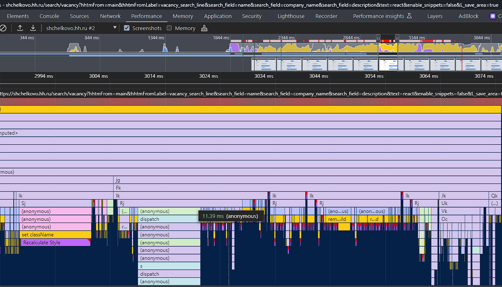

# FIX: TooltipBase

- сайт: hh.ru
- проблема:

Пример с `HhTooltipBaseWithoutFix`

~1400ms

каждый тултип вызывает `restyle/relayout`

`useEffect -> appendChild -> getComputedStyle -> removeChild`

- решение:

Пример с `HhTooltipBaseWithFix`

~70ms

Делаем мутации и расчеты отдельно.

- результат: ускорение кода в 20 раз (в игрушечном примере. На проде будет такое же ускорение, но с 50ms до 2-3ms)
- код с hh:




```typescript jsx
import { type ReactElement, useEffect, useId, useState, useMemo } from 'react';
import classnames from 'classnames';

import { DropBase, type ArrowGuardDistance, type Placement } from '@hh.ru/magritte-internal-drop-base';
import { InternalLayerName } from '@hh.ru/magritte-internal-layer-name';
import { Action } from '@hh.ru/magritte-ui-action';
import { useBreakpoint } from '@hh.ru/magritte-ui-breakpoint';
import { Button } from '@hh.ru/magritte-ui-button';
import { CrossOutlinedSize24 } from '@hh.ru/magritte-ui-icon/icon';
import { Layer } from '@hh.ru/magritte-ui-layer';
import { TooltipArrow } from '@hh.ru/magritte-ui-tooltip/TooltipArrow';
import { TooltipBaseProps } from '@hh.ru/magritte-ui-tooltip/types';
import { Text } from '@hh.ru/magritte-ui-typography';
import { BaseText } from '@hh.ru/magritte-ui-typography/BaseText';

import styles from './tooltip.less';


const CSS_CLASSES = {
    enter      : styles.tooltipEnter,
    enterActive: styles.tooltipEnterActive,
    exit       : styles.tooltipExit,
    exitActive : styles.tooltipExitActive,
};

const PLACEMENTS_LIST: Placement[] = [
    'left-top',
    'left-center',
    'left-bottom',
    'top-left',
    'top-center',
    'top-right',
    'right-bottom',
    'right-center',
    'right-top',
    'bottom-left',
    'bottom-center',
    'bottom-right',
];

export const TooltipBase = ({
    visible,
    activatorRef,
    onClose,
    maxWidth = 400,
    title,
    action,
    actionClose,
    children,
    showClose,
    actionProps,
    guardDistanceToActivator = 20,
    closeByClickOutside = true,
    placement,
    forcePlacement,
    'aria-label-close': ariaLabelClose,
    role = 'tooltip',
    ...props
}: TooltipBaseProps): ReactElement | null => {
    const { isMobile }                                  = useBreakpoint();
    const id                                            = useId();
    const ariaLabledBy                                  = `tooltip-aria-label-${ id }`;
    const ariaDescribedBy                               = `tooltip-aria-description-${ id }`;
    const [ animationTimeout, setAnimationTimeout ]     = useState(200);
    const [ arrowGuardDistance, setArrowGuardDistance ] = useState<ArrowGuardDistance>({
        left  : { top: 0, bottom: 0, center: 0 },
        right : { top: 0, bottom: 0, center: 0 },
        top   : { left: 0, center: 0, right: 0 },
        bottom: { left: 0, center: 0, right: 0 },
    });
    const placementsList                                = useMemo(
        () => (forcePlacement ? placement : [ placement, ...PLACEMENTS_LIST.filter((place) => place !== placement) ]),
        [ placement, forcePlacement ],
    );

    const ariaRole = role === 'tooltip' && action ? 'alertdialog' : role;

    useEffect(() => {
        const cssVariablesElement = document.createElement('div');
        cssVariablesElement.classList.add(styles.cssVariablesElement);
        document.body.appendChild(cssVariablesElement);
        const style = window.getComputedStyle(cssVariablesElement);

        const animationTimeout = parseInt(style.getPropertyValue(`--animation-duration`), 10);
        if (Number.isInteger(animationTimeout)) {
            setAnimationTimeout(animationTimeout);
        }

        const arrowSize             = parseInt(style.getPropertyValue('top'), 10);
        const arrowOffset           = parseInt(style.getPropertyValue('right'), 10);
        const arrowOffsetVertical   = parseInt(style.getPropertyValue('bottom'), 10);
        const arrowOffsetHorizontal = parseInt(style.getPropertyValue('left'), 10);
        if (
            Number.isInteger(arrowSize) &&
            Number.isInteger(arrowOffset) &&
            Number.isInteger(arrowOffsetVertical) &&
            Number.isInteger(arrowOffsetHorizontal)
        ) {
            setArrowGuardDistance(
                action
                ? {
                        left  : {
                            top   : arrowOffset + arrowSize / 2,
                            bottom: arrowOffsetVertical + arrowSize / 2,
                            center: 0,
                        },
                        right : {
                            top   : arrowOffset + arrowSize / 2,
                            bottom: arrowOffsetVertical + arrowSize / 2,
                            center: 0,
                        },
                        top   : {
                            left  : arrowOffsetHorizontal + arrowSize / 2,
                            center: 0,
                            right : arrowOffsetHorizontal + arrowSize / 2,
                        },
                        bottom: {
                            left  : arrowOffset + arrowSize / 2,
                            center: 0,
                            right : arrowOffset + arrowSize / 2,
                        },
                    }
                : {
                        left  : {
                            top   : arrowOffset + arrowSize / 2,
                            bottom: arrowOffset + arrowSize / 2,
                            center: 0,
                        },
                        right : {
                            top   : arrowOffset + arrowSize / 2,
                            bottom: arrowOffset + arrowSize / 2,
                            center: 0,
                        },
                        top   : {
                            left  : arrowOffset + arrowSize / 2,
                            center: 0,
                            right : arrowOffset + arrowSize / 2,
                        },
                        bottom: {
                            left  : arrowOffset + arrowSize / 2,
                            center: 0,
                            right : arrowOffset + arrowSize / 2,
                        },
                    },
            );
        }

        document.body.removeChild(cssVariablesElement);
    }, [ action, setAnimationTimeout ]);

    if (isMobile) {
        return null;
    }

    return (
        <Layer layer={ InternalLayerName.Tooltip }>
            <DropBase
                { ...props }
                placement={ placementsList }
                visible={ visible }
                activatorRef={ activatorRef }
                arrowGuardDistance={ arrowGuardDistance }
                closeByClickOutside={ closeByClickOutside }
                onClose={ onClose }
                autoFocusWhenOpened={ ariaRole !== 'tooltip' }
                guardDistanceToActivator={ guardDistanceToActivator }
                guardDistanceToViewport={ 0 }
                allowShrinkHeightToFitIntoViewport={ false }
                animationClassNames={ CSS_CLASSES }
                animationTimeout={ animationTimeout }
                role={ ariaRole }
                aria-labelledby={ title && role !== 'tooltip' ? ariaLabledBy : undefined }
                aria-describedby={ role !== 'tooltip' ? ariaDescribedBy : undefined }
            >
                { () => (
                    <div
                        data-qa="tooltip"
                        className={ classnames(styles.tooltip, {
                            [styles.tooltipWithAction]: action,
                            [styles.tooltipWithClose] : !action && showClose,
                        }) }
                        style={ {
                            maxWidth: `${ maxWidth }px`,
                        } }
                    >
                        { title && (
                            <div className={ styles.tooltipTitle }>
                                <BaseText
                                    id={ ariaLabledBy }
                                    data-qa="tooltip-title"
                                    Element="div"
                                    style="primary"
                                    typography="title-5-semibold"
                                >
                                    { title }
                                </BaseText>
                            </div>
                        ) }
                        <Text typography="paragraph-2-regular" id={ ariaDescribedBy }>
                            { children }
                        </Text>
                        { action && (
                            <div className={ styles.tooltipActions }>
                                <Button
                                    data-qa="tooltip-action"
                                    { ...actionProps }
                                    style="contrast"
                                    mode="secondary"
                                    size="small"
                                >
                                    { action }
                                </Button>
                                { actionClose && (
                                    <Button
                                        data-qa="tooltip-close-action"
                                        onClick={ () => onClose?.() }
                                        style="contrast"
                                        mode="tertiary"
                                        size="small"
                                    >
                                        { actionClose }
                                    </Button>
                                ) }
                            </div>
                        ) }
                        { !action && showClose && (
                            <div className={ styles.tooltipClose }>
                                <Action
                                    data-qa="tooltip-close-action"
                                    aria-label={ ariaLabelClose }
                                    icon={ CrossOutlinedSize24 }
                                    mode="secondary"
                                    onClick={ () => onClose?.() }
                                    style="contrast"
                                />
                            </div>
                        ) }
                        <TooltipArrow className={ styles.tooltipArrow }/>
                    </div>
                ) }
            </DropBase>
        </Layer>
    );
};

```


```typescript jsx

// isTextClamped - тут в этой функции была проблема, там считался размер блока внутри
// К сожалений найти я её не могу больше 

export default function useIsTextClamped (elementRef: MutableRefObject<HTMLElement | null>): boolean {
    const [ isClamped, setIsClamped ] = useState(false);
    const { breakpoint }              = useBreakpoint();
    useEffect(() => {
        if (elementRef.current) {
            setIsClamped(isTextClamped(elementRef.current));
        }
    }, [ breakpoint, elementRef ]);
    return isClamped;
}

```

```typescript jsx
// Компонент BottomSheetRenderFunc


useEffect(() => {
    const animationTimeoutElement = document.createElement('div');
    animationTimeoutElement.classList.add(styles.animationTimeout);
    document.body.appendChild(animationTimeoutElement);
    const style  = window.getComputedStyle(animationTimeoutElement);
    const enter  = toNumber(style.getPropertyValue(CSS_VAR_ENTER_ANIMATION_DURATION));
    const exit   = toNumber(style.getPropertyValue(CSS_VAR_EXIT_ANIMATION_DURATION));
    const height = toNumber(style.getPropertyValue(CSS_VAR_HEIGHT_ANIMATION_DURATION));
    document.body.removeChild(animationTimeoutElement);
    setAnimationTimeout({ appear: { enter, exit }, height: { enter: height, exit } });
}, [ setAnimationTimeout ]);
```